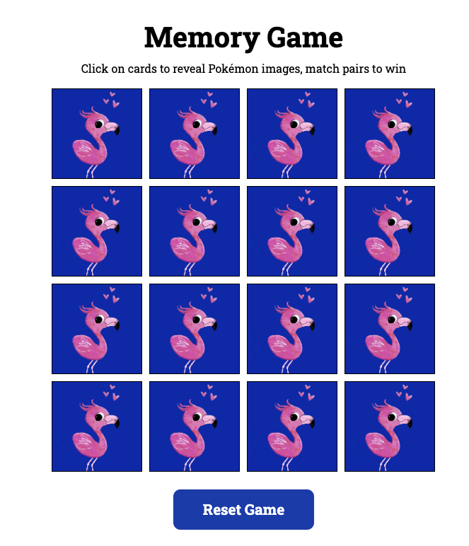

# Memory Game: Pokémon Edition

### About

This is a fun and interactive memory game built using React Vite and the Pokémon API.

### How to play

#### Gameplay:

- The app pulls 8 random pairs of Pokémon images from the PokéAPI (currently from 24 cards in total).
- The player clicks on any two cards to reveal their Pokémon images.
- If the images match the two cards disappear
- If the images don't match, they flip back over after a short delay.
- Continue flipping pairs until all cards are matched and removed from the board
- When all cards are gone, a congratulatory message appears
- The player can reset the game at any time to play again.

### Screenshot



## My process

I have always loved to play the memory game. Here's a simple version built from scratch.

Things to consider:

- Build my next project based on a figma file
- The back of the cards display a pink flamingo that I have illustrated. The flamingo art and the Pokémons don't match in style. Later on, I can perhaps create an API based on my own art 😅

### Built with

- HTML, CSS, React Vite and Pokemon API

### What I learned and bugs to be worked on

- Ensured that the game begins on the start page using the following code:

```js
useEffect(() => {
  resetGame();
}, []);
```

- Ensured that when a new game starts a new set of pokemons is pulled from the API. I set the limit pulled to 24.

```js
fetch("https://pokeapi.co/api/v2/pokemon?limit=24");
```

- Added instructions to the player, remembering to include fragment tags within the ternary operator.

```js
 return (
    <section className="game-container">
      {gameOver ? (
        <h1>Yay! Way to go!✨</h1>
      ) : (
        <>
          <h1>Memory Game</h1>
          <p className="instructions">
            Click on cards to reveal Pokémon images, match pairs to win
          </p>
        </>
      )}
      {isLoading ? (
        <p>Loading...</p>
      ) : (
        //Render the Pokemon cards if data is loaded
```

## Resources

[PokéAPI](https://pokeapi.co/)

[Youtube JS Memory Match Game](https://www.youtube.com/watch?v=Z2O3QxpcdSk)

[Building a React JS App with the Pokémon API](https://www.youtube.com/watch?v=HaEB0vdxpdg)

[React Custom Hooks useFetch - Pokémon API](https://www.youtube.com/watch?v=Xi74CW4lxig)
